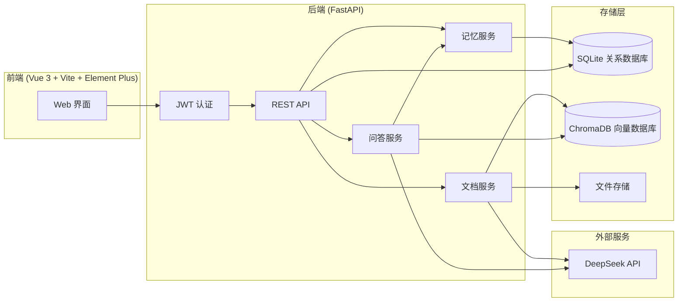

# Knowledge RAG — 企业级智能知识库系统

基于 **FastAPI + Vue 3 + DeepSeek API + ChromaDB** 的全栈 RAG (检索增强生成) 知识库平台。支持文档上传与自动解析、两类分类管理、标签体系、来源引用与置信度评估的智能问答，以及短期/长期双记忆机制。

## 功能概览

| 模块 | 功能 |
|---|---|
| 知识库管理 | 创建、编辑、删除知识库；公开 / 私有可见性控制 |
| 分类管理 | 两级分类树，支持新建、编辑、删除子分类 |
| 文档管道 | 上传 PDF / DOCX / TXT / MD / 图片；自动解析、分块、向量化 |
| 标签系统 | 自由标签，支持多对多文档关联和交叉筛选 |
| 智能问答 | 基于知识库的 RAG 问答，附带来源引用和置信度评估 |
| 短期记忆 | 会话窗口内的上下文对话记忆（可配置轮数） |
| 长期记忆 | 对话历史持久化存储，支持 Markdown 导出 |
| 用户偏好 | 可配置的记忆窗口、默认知识库等偏好设置 |
| 权限控制 | 多用户、Admin / User 角色、知识库可见性隔离 |

## 系统架构



## 技术栈

| 层级 | 技术选型 |
|---|---|
| 后端框架 | FastAPI + Uvicorn |
| 前端框架 | Vue 3 + TypeScript + Vite |
| UI 组件库 | Element Plus + Pinia 状态管理 |
| 大模型 | DeepSeek API (chat + embedding) |
| 向量数据库 | ChromaDB (嵌入式模式，零配置部署) |
| 关系数据库 | SQLite (可通过 DATABASE_URL 一键切换 PostgreSQL) |
| 认证 | JWT (python-jose + bcrypt) |
| 文档解析 | pdfplumber / python-docx / pytesseract (OCR) |

## 快速开始

### 环境要求

- Python 3.11+
- Node.js 18+
- DeepSeek API Key (可选 — 无 API Key 时系统自动切换为关键词检索模式)

### 1. 克隆项目

```bash
git clone https://github.com/YOUR_USERNAME/knowledge-rag.git
cd knowledge-rag
```

### 2. 后端配置

```bash
# 创建虚拟环境
python -m venv .venv

# 激活虚拟环境 (Windows)
.venv\Scripts\activate
# 激活虚拟环境 (macOS / Linux)
source .venv/bin/activate

# 安装依赖
pip install -r backend/requirements.txt

# 配置环境变量
cp .env.example .env
# 编辑 .env，填写 DEEPSEEK_API_KEY（可选，开发模式下不填也能用）
```

### 3. 前端配置

```bash
cd frontend
npm install
cd ..
```

### 4. 启动

```bash
# 终端 1 — 启动后端 (端口 8000)
cd backend
uvicorn app.main:app --reload --port 8000

# 终端 2 — 启动前端 (端口 5173)
cd frontend
npm run dev
```

### 5. 使用

打开浏览器访问 **http://localhost:5173** → 注册账号 → 创建知识库 → 上传文档 → 开始提问。

## 项目结构

```
knowledge-rag/
├── backend/
│   ├── app/
│   │   ├── main.py                  # FastAPI 入口，CORS，路由注册
│   │   ├── config.py                # 环境变量与配置管理
│   │   ├── database.py              # SQLAlchemy 引擎与会话
│   │   ├── api/                     # 路由模块
│   │   │   ├── auth.py              # 注册、登录、当前用户
│   │   │   ├── kb.py                # 知识库 CRUD + 分类管理
│   │   │   ├── document.py          # 文档上传、列表、删除、标签、分类
│   │   │   └── qa.py                # 智能问答、对话管理
│   │   ├── core/
│   │   │   ├── security.py          # JWT 生成/校验、密码哈希
│   │   │   └── deps.py              # 依赖注入 (当前用户、管理员守卫)
│   │   ├── models/                  # SQLAlchemy ORM 模型
│   │   │   ├── user.py              # 用户
│   │   │   ├── knowledge_base.py    # 知识库
│   │   │   ├── document.py          # 文档、标签关联
│   │   │   └── conversation.py      # 会话、消息
│   │   ├── schemas/                 # Pydantic 请求/响应模型
│   │   └── services/               # 业务逻辑层
│   │       ├── auth_service.py      # 认证服务
│   │       ├── kb_service.py        # 知识库服务
│   │       ├── document_service.py  # 文档解析、分块、向量化、关键词检索
│   │       ├── qa_service.py        # 检索、生成、引用组装
│   │       └── memory_service.py    # 短期/长期记忆管理
│   ├── uploads/                     # 上传文件存储
│   ├── chroma_data/                 # ChromaDB 向量持久化
│   └── requirements.txt
├── frontend/
│   ├── src/
│   │   ├── views/
│   │   │   ├── LoginView.vue             # 登录/注册页
│   │   │   ├── DashboardView.vue         # 知识库列表 (卡片网格)
│   │   │   ├── KnowledgeBaseView.vue     # 知识库详情 (文档、分类、上传)
│   │   │   ├── QAChatView.vue            # 问答对话页 (含引用面板)
│   │   │   └── HistoryView.vue           # 对话历史
│   │   ├── components/
│   │   │   └── layout/AppLayout.vue      # 侧边栏 + 主布局
│   │   ├── stores/                       # Pinia 状态管理
│   │   │   ├── auth.ts                   # 认证状态
│   │   │   ├── kb.ts                     # 知识库状态
│   │   │   └── chat.ts                   # 对话状态
│   │   ├── api/client.ts                 # Axios 封装 (JWT 拦截器)
│   │   └── router/index.ts              # Vue Router 路由配置
│   ├── package.json
│   └── vite.config.ts
├── .env.example
├── .gitignore
└── README.md
```

## API 概览

| 方法 | 路径 | 说明 |
|---|---|---|
| POST | `/api/auth/register` | 注册新用户 |
| POST | `/api/auth/login` | 登录，返回 JWT Token |
| GET | `/api/auth/me` | 获取当前用户信息 |
| GET | `/api/kb` | 获取知识库列表 |
| POST | `/api/kb` | 创建知识库 |
| GET | `/api/kb/{id}` | 获取知识库详情 (含分类树) |
| PUT | `/api/kb/{id}` | 更新知识库 |
| DELETE | `/api/kb/{id}` | 删除知识库 |
| GET | `/api/kb/{id}/categories` | 获取分类列表 (树形) |
| POST | `/api/kb/{id}/categories` | 创建分类 |
| POST | `/api/kb/{id}/documents/upload` | 上传文档 |
| GET | `/api/kb/{id}/documents` | 文档列表 (支持筛选) |
| PUT | `/api/kb/{id}/documents/{did}/category` | 更新文档分类 |
| PUT | `/api/kb/{id}/documents/{did}/tags` | 更新文档标签 |
| POST | `/api/qa/ask` | 提问 (RAG 问答) |
| GET | `/api/qa/conversations` | 获取对话历史列表 |
| GET | `/api/qa/conversations/{id}` | 获取对话消息 |
| DELETE | `/api/qa/conversations/{id}` | 删除对话 |
| GET | `/api/qa/conversations/{id}/export` | 导出对话为 Markdown |

## 设计要点

- **ChromaDB 嵌入式模式**：零配置向量存储，无需单独部署向量数据库服务，数据直接持久化到 `backend/chroma_data/`。
- **关键词检索降级**：未配置 DeepSeek API Key 时，系统自动切换为 CJK 二元组 + 单词重叠的关键词检索方案，确保开发模式下问答功能仍然可用。
- **确定性哈希向量**（降级方案）：无 Embedding API 时，对文本块进行 SHA-256 哈希生成确定性向量，不依赖外部服务即可完成基本检索。
- **路径脱离 CWD**：数据库、ChromaDB 和上传目录的路径均以 `config.py` 所在位置解析，不受 `uvicorn` 启动目录影响。
- **SQLite 默认，PostgreSQL 可切换**：修改 `DATABASE_URL` 即可切换至任何 SQLAlchemy 支持的数据库，表结构完全由 ORM 定义，无手写 SQL。

## 环境变量

| 变量 | 必填 | 默认值 | 说明 |
|---|---|---|---|
| `DEEPSEEK_API_KEY` | 否 | (空) | DeepSeek API 密钥，用于 LLM 对话和向量嵌入 |
| `SECRET_KEY` | 否 | `change-me-...` | JWT 签名密钥 (生产环境务必修改) |
| `DATABASE_URL` | 否 | `sqlite:///./knowledge_rag.db` | 数据库连接字符串 |
| `CORS_ORIGINS` | 否 | `["http://localhost:5173"]` | 允许的跨域来源 |
| `CHUNK_SIZE` | 否 | `512` | 文档分块大小 |
| `RETRIEVAL_TOP_K` | 否 | `5` | 每次检索返回的片段数量 |

## 开源协议

MIT
